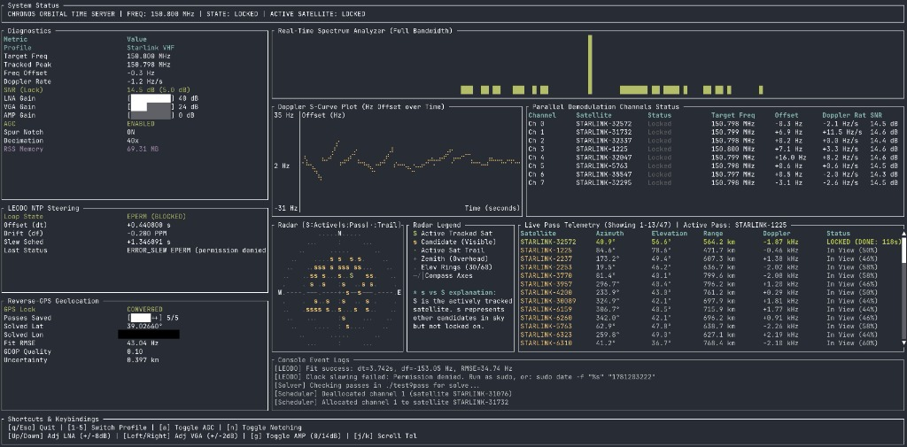

# `sattime`: LEO Satellite Tracking Receiver & Time Server



`sattime` is a high-performance, Rust-based Software Defined Radio (SDR) carrier-tracking receiver and satellite-disciplined time server daemon. Designed for Low Earth Orbit (LEO) satellite constellations (e.g., Starlink, NOAA, Orbcomm, Iridium), the system uses passive Doppler oscillometry to achieve relative positioning and microsecond-level local system clock synchronization—completely offline, without requiring a commercial internet connection.

> [!NOTE]
> **Real-World Testing & Hardware Setup**: During active development and live testing, the system consistently achieved signal locks and converged geodetic solutions using a highly accessible, indoor hardware setup: a simple **metal whip antenna magnetically mounted to a cookie sheet** (acting as a ground plane) sitting **inside a basement**, connected to a **HackRF One** SDR. This highlights the robustness of the 3-state carrier PLL-EKF and symbol tracking algorithms under heavily obstructed, non-ideal signal conditions.

---

## Key Components

- **LEO Doppler Tracking**: Actively tracks high-velocity Doppler frequency curves from LEO satellites passing overhead to compute relative motion.
- **Multi-Channel Parallel Tracking**: Concurrently tracks up to 8 satellites in parallel, distributing digital downconversion (DDC) and decimation filters across a Rayon-backed thread pool for real-time operation.
- **3-State Carrier PLL-EKF**: A sample-by-sample Extended Kalman Filter (PLL-EKF) that tracks carrier phase, frequency, and chirp-rate (frequency acceleration) to lock onto weak satellite downlink signals even in extreme noise.
- **Gardner Symbol Timing Recovery**: A feedback timing loop utilizing a Farrow parabolic interpolator and Proportional-Integral (PI) loop filter to achieve sub-sample symbol synchronization on PSK telemetry.
- **Reverse-GPS Geodetic Solver**: A geodetic Gauss-Newton solver that computes the receiver's 3D coordinates on the WGS84 ellipsoid by fitting observed Doppler curves against known satellite orbits (TLEs).
- **LEODO Clock Discipline**: A Low Earth Orbit Doppler Oscillometry EKF that measures local quartz oscillator phase and frequency drift, steering the host system clock to microsecond-level accuracy via the `libc::adjtime` system call.
- **Real-Time Ratatui TUI**: An interactive terminal dashboard that displays the RF spectrum analyzer, EKF tracker state metrics, real-time clock discipline statistics, and an ASCII world tracking map with probability shading.

---

## Build & Hardware Requirements

### Software Requirements
- **Rust Toolchain**: Stable compiler (Rust 1.70+ recommended).
- **Operating System**: Linux or macOS. (Clock discipline features require `libc::adjtime`).
- **Dependencies**:
  - `libusb` (for hardware SDR communication).
  - `SoapySDR` library and driver modules for your receiver.
  - A C compiler and `pkg-config` for building FFI bindings.

### Hardware Requirements
- **SDR Receiver**: RTL-SDR, HackRF, LimeSDR, Airspy, or any other receiver supported by SoapySDR.
- **Antenna**: A VHF/UHF antenna suitable for LEO reception. See the summary table below and the dedicated [Antenna Design & Tuning Guide](docs/antenna_tuning_guide.md) for detailed construction diagrams and physical calculations.

---

## Antenna Tuning Guide

For detailed construction diagrams, velocity factor calculations, turnstile phase delay lines, common-mode choke baluns, and NanoVNA verification methods, see the dedicated [Antenna Design & Tuning Guide](docs/antenna_tuning_guide.md).

LEO satellites transmit signals with specific polarizations (typically Right-Hand Circular Polarization, RHCP) and operate on different frequency bands. To achieve optimal signal locks, your antenna elements must be tuned (cut) to the correct wavelength ($\lambda$) for each satellite swarm:

| Satellite Swarm | Downlink Frequency | Wavelength ($\lambda$) | Recommended Antenna Type | Quarter-Wave Element Length ($\lambda / 4$) |
| :--- | :--- | :--- | :--- | :--- |
| **NOAA Weather** | $137.1\text{–}137.9\text{ MHz}$ | $\approx 2.19\text{ m}$ | QFH or V-Dipole | $52.0\text{ cm}$ (per dipole leg) |
| **Orbcomm M2M** | $137.5\text{ MHz}$ | $\approx 2.18\text{ m}$ | QFH or Turnstile | $51.8\text{ cm}$ (per element) |
| **Amateur Satellites** | $145.8\text{–}146.0\text{ MHz}$ | $\approx 2.05\text{ m}$ | Eggbeater or Yagi | $49.0\text{ cm}$ (per element) |
| **Starlink VHF** | $150.8\text{ MHz}$ | $\approx 1.99\text{ m}$ | Whip on Ground Plane | $49.7\text{ cm}$ (whip length) |
| **Iridium L-Band** | $1621.0\text{–}1626.5\text{ MHz}$| $\approx 18.4\text{ cm}$ | Active L-Band Patch | $4.6\text{ cm}$ (patch/helix element) |

### Swarm-Specific Tuning Details

#### 1. NOAA & Orbcomm (137 MHz band)
*   **The V-Dipole**: For a quick, zero-cost build, construct a V-dipole using two $52\text{ cm}$ copper wire legs. Mount them horizontally at a $120^\circ$ angle, oriented North-South.
*   **The QFH (Quadrifilar Helix)**: The gold standard for omnidirectional weather satellite reception. It uses circularly polarized loops to eliminate signal fading as the satellite spins.

#### 2. Amateur Satellites (145.8 MHz VHF)
*   **The Eggbeater**: A compact, omnidirectional RHCP antenna that has high gain straight up, making it excellent for overhead passes without requiring a rotator.
*   **Directional Yagi**: A 3-element or 5-element handheld Yagi-Uda gives the best gain but requires manual tracking (pointing it at the satellite).

#### 3. Starlink VHF (150.8 MHz)
*   **The Whip on a Ground Plane**: Starlink transmitters use vertical polarization. A simple $49.7\text{ cm}$ metal whip antenna magnetically mounted to a metal sheet (like a steel cookie sheet, filing cabinet, or car roof) acts as a highly effective ground plane. 
*   **Indoor/Basement Setup**: While line-of-sight is ideal, Starlink VHF signals are strong enough that a vertical whip stuck to a cookie sheet sitting inside a basement can still capture decodable Doppler curves.

#### 4. Iridium L-Band (1626 MHz)
*   **Active L-Band Patch**: Because L-band signals attenuate quickly in the atmosphere and do not penetrate buildings, you must use a dedicated L-band patch antenna with a built-in low-noise amplifier (LNA) placed outdoors with a clear view of the sky. Passive whip antennas will not work on this band.

---

## Running Instructions

### First-Time Use & Observer Position Kickstart
On first-time execution, `sattime` defaults to Washington D.C. coordinates (`38.889931`, `-77.009003`, `25.0`) to schedule passes and initialize the tracking filters. If starting offline with no prior position data, the background geodetic solver will automatically converge on your true location after a few satellite passes.

To **kickstart the system** and bypass this initial search, you can manually supply your approximate local GPS coordinates (latitude, longitude, and altitude in meters) using the `--lat`, `--lon`, and `--alt` command-line flags. This aligns the pass planner and EKF tracking loops with your local horizon immediately:

```bash
cargo run --release -- --sdr "driver=rtlsdr" --lat 39.02508 --lon -77.15115 --alt 87.0
```

### 1. Live SDR Mode
Stream samples directly from a connected RTL-SDR receiver to track satellites in real time:
```bash
cargo run --release -- --sdr "driver=rtlsdr"
```

### 2. Simulation Mode
Run a simulated satellite pass using a specific Two-Line Element (TLE) file, center frequency, and enable the LEODO clock steering loop:
```bash
cargo run --release -- --simulate --tle passes/starlink.tle --frequency 150800000.0 --leodo
```

### 3. Orbit Solver Mode
Determine circular orbital parameters ($a, i, \Omega_0, u_0$) and pass-specific clock offsets from raw frequency measurement logs:
```bash
cargo run --release -- --solve-orbit passes/pass_1.csv,passes/pass_2.csv
```

---

## TUI Keyboard Commands

When running the visual dashboard, use the following interactive hotkeys:

| Key | Action |
|:---:|---|
| `q` / `Esc` | Quit the application |
| `j` / `k` | Scroll the visual diagnostic logs **Down** / **Up** |
| `PageDown` / `PageUp` | Scroll the visual diagnostic logs **Down** / **Up** by 5 lines |
| `a` | Toggle **Automatic Gain Control (AGC)** ON / OFF |
| `n` | Toggle **Dynamic Background Spur Notching (Spur Notcher)** ON / OFF |
| `g` | Toggle the RF pre-amplifier gain between **0.0 dB** and **14.0 dB** |
| `Up` / `Down` | Increase / decrease **LNA gain by 8.0 dB** (forces Manual Mode, disables AGC) |
| `Left` / `Right` | Decrease / increase **VGA gain by 2.0 dB** (forces Manual Mode, disables AGC) |
| `1` | Switch active satellite profile to **NOAA** |
| `2` | Switch active satellite profile to **Orbcomm** |
| `3` | Switch active satellite profile to **Iridium** |
| `4` | Switch active satellite profile to **Starlink** |
| `5` | Switch active satellite profile to **Amateur** |

---

## File Structure

- **`src/`**: Rust source code for the time server.
  - `src/main.rs`: Application orchestrator, hardware SDR I/O loops, and TUI control logic.
  - `src/dsp.rs`: Digital signal processing (Farrow interpolators, decimators, Gardner TED, and spur notchers).
  - `src/ekf.rs`: Extended Kalman Filter implementations (Carrier phase-tracking PLL-EKF, EKF tracking banks, and Clock EKF).
  - `src/orbit.rs`: Geodetic coordinate solvers, ECEF/ENU frame conversions, SGP4 propagation, and Haversine probability shading.
  - `src/orbit_solver.rs`: Adelic Langevin Solver and multi-pass circular orbit parameter estimator.
  - `src/daemon.rs`: Background task scheduling, TLE caching, and NTP system clock discipline.
  - `src/tui.rs`: Terminal UI components rendering, stdout bells, and FFI stderr redirections.
- **`docs/`**: Detailed project guides.
  - `docs/conceptual_guide.md`: Accessible, analogy-driven explanations of the core tracking and signal processing algorithms.
  - `docs/technical_reference.md`: Rigorous mathematical formulations, physical equations, and RF engineering specifications.
- **`tests/`**: Unit, integration, and stress test suites.
- **`passes/`**: Reference TLE and pass recording CSV files.

For deeper insights, please read the [Conceptual Guide](docs/conceptual_guide.md) and the [Technical Reference](docs/technical_reference.md).
