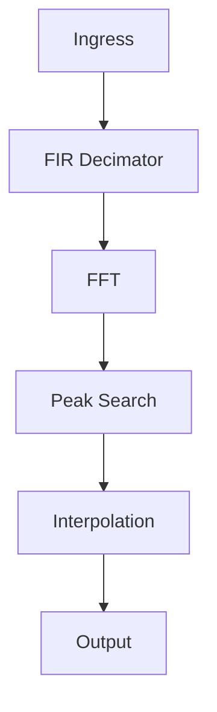
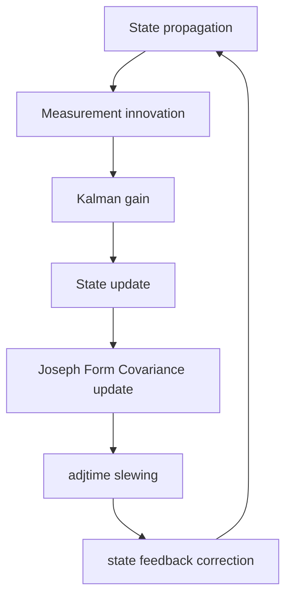

# Chronos Sattime System and Mathematical Analysis Report

This report provides the detailed mathematical models, equations, algorithms, and system implementation architectures of the `sattime` codebase. The project is modularized into several core components:
- `dsp.rs`: Digital signal processing (FIR filters, Gardner TED, decimators).
- `ekf.rs`: Extended Kalman Filters (PLL tracking and clock modeling).
- `orbit.rs`: Geolocation, Doppler modeling, and orbit propagation (SGP4/Levenberg-Marquardt).
- `daemon.rs`: Background pass recording and scheduling tasks.
- `tui.rs`: Ratatui terminal user interface rendering.
- `main.rs`: Orchestration, SDR hardware I/O, and tracking logic loops.

---

## 1. SDR & DSP Pipeline

The Software Defined Radio (SDR) and Digital Signal Processing (DSP) pipeline is responsible for streaming IQ samples, decimating the sample rate to isolate the carrier bandwidth, performing spectral analysis, and identifying tracking frequency peaks.



### 1.1 I/O IQ Sampling
- **Sample Representation**: Raw IQ samples are represented as complex single-precision floating-point numbers (`num_complex::Complex<f32>`).
- **Hardware Integration**: The application uses the `soapysdr` FFI bindings to interact with hardware receivers.
- **Dynamic Control**: Communication between the TUI/main thread and the receiver thread utilizes a thread-safe channel passing the `SdrCommand` enum:
  ```rust
  enum SdrCommand {
      AdjustLna(f64),      // Adjust Low-Noise Amplifier gain (dB)
      AdjustVga(f64),      // Adjust Variable Gain Amplifier gain (dB)
      AdjustAmp(f64),      // Toggle/Adjust RF front-end amplifier (dB)
      TuneFrequency(f64),  // Sintonize center local oscillator frequency (Hz)
  }
  ```
- **SDR Streaming API**:
  ```rust
  fn soapysdr::Device::set_sample_rate(direction: Direction, channel: usize, rate: f64) -> Result<()>
  fn soapysdr::Device::set_frequency(direction: Direction, channel: usize, frequency: f64, args: Args) -> Result<()>
  fn soapysdr::Device::set_gain_element(direction: Direction, channel: usize, name: &str, gain: f64) -> Result<()>
  ```

### 1.2 FIR Decimator Design
To reduce CPU load and isolate the VHF Doppler shift band ($\approx \pm 20\text{ kHz}$), the raw IQ stream (sampled at $f_s \approx 2\text{ MSPS}$) is decimated by a factor $D$ (typically $40$, downsampling to $50\text{ kSPS}$) after passing through a windowed-sinc low-pass FIR filter.

- **Filter Parameter Formulas**:
  - Normalised Cutoff Frequency:
    $$f_c = \frac{f_{cutoff}}{f_s}$$
    where $f_{cutoff} = 0.4 \cdot f_{decimated}$ and $f_{decimated} = \frac{f_s}{D}$.
  - Transition Band Centre:
    $$\omega_c = 2 \pi f_c$$
  - Sinc Filter Coefficients:
    $$h_{sinc}[n] = \begin{cases} \frac{\omega_c}{\pi} & \text{if } |n - M| < 10^{-9} \\ \frac{\sin(\omega_c (n - M))}{\pi (n - M)} & \text{otherwise} \end{cases}$$
    where $M = \frac{N-1}{2}$ is the middle index, and $N$ is the number of filter taps ($N = 127$ taps).
  - Hamming Window Formulation:
    $$w[n] = 0.54 - 0.46 \cos\left(\frac{2 \pi n}{N - 1}\right), \quad n \in \{0, \dots, N-1\}$$
  - Normalised Taps:
    $$\text{taps}[n] = \frac{h_{sinc}[n] \cdot w[n]}{\sum_{k=0}^{N-1} h_{sinc}[k] \cdot w[k]}$$
    This normalisation ensures a DC gain of $0\text{ dB}$ (unity gain).

- **Implementation Details (`FirDecimator` struct)**:
  ```rust
  struct FirDecimator {
      taps: Vec<f32>,
      taps_simd: Vec<f32>,
      decimation_factor: usize,
      history: Vec<Complex<f32>>, // Stores N-1 samples of historical overlap state
      pending_offset: usize,
  }
  ```
  The `process` function computes the discrete convolution of the input stream with the filter taps, retaining fractional index step offsets between input buffers to prevent phase discontinuities.

  To lower CPU consumption during high-sample-rate ingestion, the convolution inner loop is vectorized using platform-specific SIMD instructions (AVX2/FMA on x86_64, Neon on AArch64) when supported, and falls back to a pointer-based scalar implementation otherwise. The `taps_simd` vector stores duplicated coefficients (`[t0, t0, t1, t1, ...]`) to process real and imaginary components of the complex stream concurrently.

### 1.3 FFT Peak-Search Tracking
- **FFT Resolution**: The decimated stream is processed in windows of length $N_{FFT}$ (power of two, e.g. $32768$ or $1024$) using `rustfft`.
- **Search Band Restriction**: The peak search is restricted to a frequency range of interest (within $\pm 20\text{ kHz}$ of the center local oscillator) using a maximum bin boundary:
  $$k_{max\_search} = \text{round}\left( \frac{20000.0}{f_{decimated}} \cdot N_{FFT} \right)$$
- **DC Region Skip**: Bins near the DC center ($k \le 5$ and $k \ge N_{FFT} - 5$) are skipped to avoid local oscillator leakage and DC offset spikes.
- **Static Spur Skip**: Bins identified as static spurs by the RF autotuner are masked out of the peak-search loop.
- **TLE-Guided Search Window**:
  When active tracking is guided by known orbital parameters, the search only considers bins whose corresponding frequencies $f_{bin}$ lie within `active_guided_window` of the predicted Doppler frequency:
  $$|f_{bin} - f_{expected}| < W_{guided}$$
- **Adaptive Lock Threshold**:
  The noise floor mean $\mu_{noise}$ and standard deviation $\sigma_{noise}$ are calculated over all search-band bins excluding the current peak bin.
  The relative standard deviation is:
  $$\sigma_{rel} = \frac{\sigma_{noise}}{\mu_{noise}}$$
  The minimum SNR required for locking is adjusted dynamically to account for background noise variance:
  $$\text{active\_min\_snr} = \text{base\_min\_snr} + 1.5 \cdot \max\left(0.0, \min(3.0, \sigma_{rel} - 1.0)\right)$$
  where $\text{base\_min\_snr}$ is equal to $\text{min\_snr}_{args} - 5.0\text{ dB}$ for BPSK or QPSK modulation schemes, and is equal to the configured $\text{min\_snr}_{args}$ otherwise.
  A lock is registered if:
  $$\text{raw\_snr\_db} = 10 \log_{10}\left( \frac{P_{peak}}{\mu_{noise}} \right) \ge \text{active\_min\_snr}$$
  To prevent flickering and instability near the threshold, a $4.0\text{ dB}$ hysteresis is applied. Once locked, the SNR must drop below $\text{active\_min\_snr} - 4.0\text{ dB}$ before the lock is released.
- **Quadratic Peak Interpolation**:
  To achieve sub-bin spectral resolution, a parabolic fit is performed on the natural logarithm of the spectral magnitudes of the peak bin $k_{max}$ and its adjacent bins:
  $$y_0 = \ln( \|X[k_{max}]\|_2 + 10^{-10} )$$
  $$y_{prev} = \ln( \|X[k_{max} - 1]\|_2 + 10^{-10} )$$
  $$y_{next} = \ln( \|X[k_{max} + 1]\|_2 + 10^{-10} )$$
  The peak offset deviation (clamped to $[-0.5, 0.5]$) is:
  $$\delta = \frac{y_{prev} - y_{next}}{2 (y_{prev} - 2 y_0 + y_{next})}$$
  The interpolated frequency offset is then:
  $$f_{offset} = \begin{cases} \frac{k_{max} + \delta}{N_{FFT}} \cdot f_{decimated} & \text{if } k_{max} + \delta < \frac{N_{FFT}}{2} \\ \frac{(k_{max} + \delta) - N_{FFT}}{N_{FFT}} \cdot f_{decimated} & \text{otherwise} \end{cases}$$

### 1.4 3-State Carrier Phase-Tracking EKF (PLL-EKF)
To track weak, high-acceleration Doppler carrier leakage under extreme noise ($SNR \approx -10\text{ dB}$ after decimation), the receiver incorporates a sample-by-sample 3-State Carrier Phase-Tracking Extended Kalman Filter (PLL-EKF) that runs on the decimated IQ sample stream.

- **State Vector $x$**:
  $$x = \begin{bmatrix} \theta \\ \omega \\ \alpha \end{bmatrix}$$
  where $\theta$ is the carrier phase (radians), $\omega$ is the carrier angular frequency (radians/second), and $\alpha$ is the chirp rate (radians/second$^2$).
- **State Transition Matrix $F$**:
  $$F = \begin{bmatrix} 1 & \Delta t & \frac{1}{2} \Delta t^2 \\ 0 & 1 & \Delta t \\ 0 & 0 & 1 \end{bmatrix}$$
  where $\Delta t = 1 / f_{decimated}$ is the decimated sample interval.
- **State Propagation (Predict)**:
  $$x_k^- = F x_{k-1}^+ = \begin{bmatrix} \theta_{k-1} + \omega_{k-1} \Delta t + \frac{1}{2} \alpha_{k-1} \Delta t^2 \\ \omega_{k-1} + \alpha_{k-1} \Delta t \\ \alpha_{k-1} \end{bmatrix}$$
  The phase state $\theta_k^-$ is wrapped to the range $[-H_L, H_L)$ (where $H_L = \pi$ for Carrier, $H_L = \pi/2$ for BPSK, and $H_L = \pi/4$ for QPSK) using the Euclidean remainder:
  $$\theta_k^- \leftarrow \text{rem\_euclid}(\theta_k^- + H_L, 2 \cdot H_L) - H_L$$
- **Covariance Propagation**:
  $$P_k^- = F P_{k-1}^+ F^T + Q$$
  where $Q$ is the diagonal process noise covariance matrix representing model uncertainty:
  $$Q = \begin{bmatrix} q_{\theta} \cdot s_m \cdot \Delta t & 0 & 0 \\ 0 & q_{\omega} \cdot s_m \cdot \Delta t & 0 \\ 0 & 0 & q_{\alpha} \cdot s_m \cdot \Delta t \end{bmatrix}$$
  Define $s_m$ as:
  $$s_m = 1.0 - 0.9 \cdot \text{clamp}(M_{lock, k}, 0.0, 1.0)$$
  where $M_{lock, k}$ is the phase-coherence lock metric at step $k$ (which acts to reduce the filter bandwidth when locked), and with default tuning parameters $q_{\theta} = 10^{-1}$, $q_{\omega} = 5 \cdot 10^3$, and $q_{\alpha} = 10^4$.
- **Linearized Phase-Error Measurement Update**:
  Let $y_k$ be the complex decimated sample. To avoid a non-linear observation model, $y_k$ is first derotated by the predicted phase $\theta_k^-$:
  $$y'_k = y_k \cdot e^{-j \theta_k^-}$$
  The phase innovation $z_k$ is calculated based on the modulation type:
  - **Carrier**:
    $$z_k = \text{atan2}(\text{Im}(y'_k), \text{Re}(y'_k))$$
  - **BPSK**:
    $$z_k = 0.5 \cdot \text{atan2}\left(2 \cdot \text{Re}(y'_k) \text{Im}(y'_k), \, \text{Re}(y'_k)^2 - \text{Im}(y'_k)^2\right)$$
  - **QPSK**:
    Let $I_2 = \text{Re}(y'_k)^2 - \text{Im}(y'_k)^2$ and $Q_2 = 2 \cdot \text{Re}(y'_k) \text{Im}(y'_k)$.
    $$z_k = 0.25 \cdot \text{atan2}\left(2 \cdot I_2 Q_2, \, I_2^2 - Q_2^2\right)$$
  The observation row vector is completely linear:
  $$H = \begin{bmatrix} 1 & 0 & 0 \end{bmatrix}$$
  The innovation covariance is:
  $$S = H P_k^- H^T + r_{\text{effective}} = P_{00}^- + r_{\text{effective}}$$
  where instead of a static observation variance $R$, the EKF dynamically scales the phase measurement covariance at each step $k$:
  $$r_{\text{effective}} = R \cdot \text{snr\_factor} \cdot \text{fade\_factor}$$
  where $R = 10.0$ is the base measurement phase error variance, and:
  $$\text{snr\_factor} = \text{clamp}\left(\frac{1.0 - M_{lock, k}}{M_{lock, k}}, 0.1, 100.0\right)$$
  and:
  $$\text{fade\_factor} = \frac{1.0}{\max\left(10^{-4}, A_{rel}^2\right)}$$
  where $A_{rel} = \frac{A_k}{\bar{A}_k}$ represents the relative sample amplitude $A_k = \|y_k\|_2$ normalized by its exponential moving average (EMA) envelope $\bar{A}_k$.
  The Kalman gain vector is:
  $$K = \begin{bmatrix} k_0 \\ k_1 \\ k_2 \end{bmatrix} = \frac{1}{S} \begin{bmatrix} P_{00}^- \\ P_{10}^- \\ P_{20}^- \end{bmatrix}$$
  The state vector is updated as:
  $$x_k^+ = x_k^- + K z_k$$
- **Joseph Form Covariance Update**:
  To ensure numerical stability and guarantee that $P$ remains positive-semidefinite under finite-precision arithmetic, the covariance matrix is updated using:
  $$P_k^+ = (I - K H) P_k^- (I - K H)^T + K r_{\text{effective}} K^T$$
- **Lock Metric and Dual-Stage Tracking**:
  The carrier lock status is tracked using a slow leaky-integrator normalized real-part metric of the derotated sample:
  $$M_{lock, k} = (1 - \beta) M_{lock, k-1} + \beta \frac{\text{Re}(y'_k)}{\|y'_k\|}$$
  where $\beta = 0.001$. The EKF tracking loop runs independently of the block-FFT acquisition loop. Carrier lock status is governed by a dual-metric approach. The primary lock indicator is the block-FFT SNR threshold. When enabled, a secondary `Adaptive EKF` threshold uses the PLL's phase-coherence lock metric. If the FFT SNR exceeds the acquisition threshold *and* the EKF lock metric exceeds a predefined threshold (e.g., $0.2$), the system enters a coherent lock state. A brief signal fade or phase slip will drop the EKF lock metric rapidly, causing a lock release, but the FFT SNR hysteresis may "ride through" the fade and immediately re-acquire once the SNR recovers.

### 1.5 Gardner Timing Error Detector (TED)
To synchronize fractional sample boundaries and recover the precise symbol timing of BPSK/QPSK telemetry streams, a Gardner Timing Error Detector loop operates on the baseband-derotated complex samples.
- **Timing Error Formulation**:
  $$e[k] = \text{Re}\{(y[k] - y[k-2]) \cdot y^*[k-1]\}$$
  where $y[k]$ is the current interpolated symbol, $y[k-2]$ is the previous symbol, and $y[k-1]$ is the midway transition sample.
- **Loop Filter**:
  The timing error is passed through a Proportional-Integral (PI) filter to estimate the instantaneous symbol period.
- **Fractional Delay Correction**:
  The loop adjusts a fractional interpolation index $\mu \in [0, 1)$. Farrow parabolic interpolation resamples the data at the inter-sample fractional index.
- **Phase Offset Tracking Feedback**:
  The phase of the numerically controlled oscillator (NCO) in the PLL-EKF must be adjusted to account for the fractional timing delay introduced by the interpolator. When a symbol is yielded by the Gardner loop, its corresponding local oscillator reference phase is retroactively adjusted by the sub-sample delay offset:
  $$\theta_{true} = \theta - \omega \cdot (3.0 - \mu) \cdot \Delta t$$
  This ensures phase-coherence for the EKF tracking update step.

### 1.6 Extensive Cancellation Algorithm (ECA)
For environments with significant multipath propagation or transmitter local oscillator leakage, the receiver enables the Extensive Cancellation Algorithm (ECA) by default to replace basic block mean subtraction. It can be disabled using the `--no-eca` command line flag.

ECA models the static clutter and direct-path leakage as a projection onto a delay-history subspace. Let $\mathbf{x} = [x[0], \dots, x[N-1]]^T$ be the input block of surveillance samples, and let $\mathbf{x}_{ext} = [\mathbf{h}_{old}; \mathbf{x}]$ be the input block extended by 6 historical samples to guarantee filter continuity. The delay-history matrix $\mathbf{B}$ of size $N \times 6$ is defined as:
$$\mathbf{B}_{i, j} = x_{ext}[5 + i - j], \quad i \in \{0, \dots, N-1\}, \, j \in \{0, \dots, 5\}$$

The projection weights $\mathbf{w}$ are obtained by solving the regularized least-squares problem:
$$(\mathbf{B}^H \mathbf{B} + \tau \mathbf{I}) \mathbf{w} = \mathbf{B}^H \mathbf{x}$$
where:
- $\mathbf{B}^H \mathbf{B}$ is the $6 \times 6$ covariance matrix of the clutter subspace.
- $\tau = 1e^{-3} \cdot N$ is a Tikhonov regularization factor (ridge regression) that prevents the filter from achieving "perfect" cancellation of the moving target signals.
- $\mathbf{I}$ is the identity matrix.

To minimize latency, the correlation matrix $\mathbf{R} = \mathbf{B}^H \mathbf{B}$ is computed efficiently:
1. The first row $\mathbf{R}_{0, d}$ is evaluated directly in $O(N)$ operations:
   $$\mathbf{R}_{0, d} = \sum_{i=0}^{N-1} x_{ext}[5 + i]^* x_{ext}[5 + i - d], \quad d \in \{0, \dots, 5\}$$
2. The remaining rows are updated in $O(1)$ operations via a sliding window:
   $$\mathbf{R}_{j, j+d} = \mathbf{R}_{j-1, j-1+d} + x_{ext}[5 - j]^* x_{ext}[5 - j - d] - x_{ext}[5 - j + N]^* x_{ext}[5 - j + N - d]$$
3. The lower triangle of $\mathbf{R}$ is filled via Hermitian symmetry: $\mathbf{R}_{k, j} = \mathbf{R}_{j, k}^*$.

The $6 \times 6$ system is solved using Cholesky decomposition ($\mathbf{R} + \tau \mathbf{I} = \mathbf{L} \mathbf{L}^H$) followed by forward and backward substitution. The clutter-suppressed output block is then:
$$\mathbf{y} = \mathbf{x} - \mathbf{B} \mathbf{w}$$

---

## 2. RF Autotuning

The RF Autotuning system isolates genuine moving satellite Doppler curves from static local electromagnetic interference (spurs) and regulates hardware gain.

### 2.1 Persistence-Filtered Spur Notching
- **EMA Magnitude Integration**:
  To construct a stable noise baseline, the magnitude-squared output of each search bin is integrated via an Exponential Moving Average (EMA):
  $$M_{EMA, k} \leftarrow (1 - \alpha) M_{EMA, k} + \alpha \|X[k]\|_2^2, \quad \alpha = 0.001$$
- **Dynamic Thresholding**:
  Every 1000 FFT frames, the median magnitude $M_{med}$ of the EMA spectrum is calculated. The threshold for spur detection is set to:
  $$T_{spur} = 16.0 \cdot \max(0.0225, M_{med})$$
  This represents an amplitude threshold of $\approx 12\text{ dB}$ above the median noise floor.
- **Persistence Verification**:
  If a bin's EMA value exceeds $T_{spur}$, a consecutive lock counter is incremented:
  $$\text{counts}[k] \leftarrow \begin{cases} \text{counts}[k] + 1 & \text{if } M_{EMA, k} > T_{spur} \\ 0 & \text{otherwise} \end{cases}$$
  A bin is classified as a static spur if $\text{counts}[k] \ge 10$. Moving satellite signals change frequency bins quickly due to Doppler drift, which prevents them from triggering the persistence filter, whereas stationary spurs are successfully notched.

### 2.2 Hardware AGC Feedback Loop Rules
The Automatic Gain Control (AGC) loop executes every 2,000,000 raw samples ($\approx 1\text{ second}$ at $2\text{ MSPS}$) to maintain optimal ADC dynamic range and prevent signal clipping.

- **Accumulators**:
  - Sample Clipping Ratio:
    $$R_{clip} = \frac{N_{clip}}{N_{total}}$$
    where a sample is clipped if $\|x[n]\|_2^2 \ge 0.98^2$.
  - Root Mean Square (RMS) Amplitude:
    $$V_{RMS} = \sqrt{\frac{1}{N_{total}} \sum_{n=1}^{N_{total}} \|x[n]\|_2^2}$$

- **Feedback Rules**:
  - **Saturation state**: If $R_{clip} > 0.005$ ($0.5\%$ clipping rate) or $V_{RMS} > 0.5$:
    - If $g_{AMP} > 0.0$:
      $$g_{AMP} \leftarrow 0.0$$
    - Else if $g_{VGA} > 0.0$:
      $$g_{VGA} \leftarrow \max(0.0, g_{VGA} - 2.0)$$
    - Else if $g_{LNA} > 0.0$:
      $$g_{LNA} \leftarrow \max(0.0, g_{LNA} - 8.0)$$
  - **Weak signal state**: If $V_{RMS} < 0.05$:
    - If $g_{LNA} < 40.0$:
      $$g_{LNA} \leftarrow \min(40.0, g_{LNA} + 8.0)$$
    - Else if $g_{VGA} < 62.0$:
      $$g_{VGA} \leftarrow \min(62.0, g_{VGA} + 2.0)$$
    - Else if $g_{AMP} < 14.0$:
      $$g_{AMP} \leftarrow 14.0$$

---

## 3. Orbit Physics & Geolocation

This subsystem implements orbital propagation models, Doppler curve estimation, Keplerian parameter fitting, receiver geodetic coordinate estimation, and probability shading.

### 3.1 SGP4 Propagation & Frame Conversion
- **SGP4 Propagation**: Standard TLE parameters are propagated using Simplified General Perturbations (SGP4) formulas, which yield satellite position $\vec{r}_{TEME}$ (km) and velocity $\vec{v}_{TEME}$ (km/s) in the True Equator Mean Equinox (TEME) ECI frame.
- **TEME to ECEF Rotation**:
  To rotate TEME coordinates to Earth-Centered, Earth-Fixed (ECEF) coordinates, the Greenwich Mean Sidereal Time (GMST) angle $\theta$ is evaluated.
  - Days since J2000 Epoch:
    $$d = JD - 2451545.0$$
  - Julian Centuries:
    $$t = \frac{d}{36525.0}$$
  - GMST in Degrees:
    $$\text{GMST} = \left(280.46061837 + 360.98564736629 \cdot d + 0.000387933 \cdot t^2 - \frac{t^3}{38710000.0}\right) \pmod{360^\circ}$$
  - Sidereal Angle in Radians:
    $$\theta = \text{GMST} \cdot \frac{\pi}{180}$$
  - Position Rotation (rotation about Z-axis):
    $$\vec{r}_{ECEF} = R_z(\theta) \vec{r}_{TEME} = \begin{bmatrix} x_{TEME}\cos\theta + y_{TEME}\sin\theta \\ -x_{TEME}\sin\theta + y_{TEME}\cos\theta \\ z_{TEME} \end{bmatrix}$$
  - Velocity Rotation (including Coriolis term):
    $$\vec{v}_{ECEF} = R_z(\theta) \vec{v}_{TEME} + \vec{\omega}_E \times \vec{r}_{ECEF} = \begin{bmatrix} (v_{x, TEME}\cos\theta + v_{y, TEME}\sin\theta) + \omega_E y_{ECEF} \\ (-v_{x, TEME}\sin\theta + v_{y, TEME}\cos\theta) - \omega_E x_{ECEF} \\ v_{z, TEME} \end{bmatrix}$$
    where $\omega_E = 7.2921151467 \times 10^{-5}\text{ rad/s}$ is Earth's rotation speed. SGP4 outputs in kilometers and km/s are scaled by $1000$ to obtain ECEF coordinates in meters and m/s.

### 3.2 Doppler Curve Estimation
- **Slant Range Vector**:
  $$\vec{r}_{slant} = \vec{r}_{ECEF, sat} - \vec{r}_{ECEF, rec}$$
- **Slant Range Distance**:
  $$d_{slant} = \|\vec{r}_{slant}\|_2$$
- **Range Rate (relative radial velocity)**:
  $$\dot{d} = \frac{\vec{r}_{slant} \cdot \vec{v}_{ECEF, sat}}{d_{slant}}$$
- **Doppler Estimation Formula**:
  $$f_{pred} = f_{center} \cdot \left(1 - \frac{\dot{d}}{c}\right) - f_{center} + df_j = - f_{center} \frac{\dot{d}}{c} + df_j$$
  where $c = 299792458.0\text{ m/s}$ is the speed of light, and $df_j$ is the local oscillator frequency bias.

### 3.3 Keplerian Circular Orbit Parameter Model
For passive TLE-less orbit determination, the satellite orbit is modelled as circular with 4 global parameters: semi-major axis $a$ (meters), inclination $i$ (radians), RAAN at epoch $\Omega_0$ (radians), and argument of latitude at epoch $u_0$ (radians).
- **Mean Motion**:
  $$n = \sqrt{\frac{\mu}{a^3}}, \quad \mu = 3.986004418 \times 10^{14}\text{ m}^3/\text{s}^2$$
- **Orbital Velocity**:
  $$v_{sat} = \sqrt{\frac{\mu}{a}}$$
- **J2 Nodal Precession Rate**:
  $$\dot{\Omega} = -1.5 \cdot J_2 \cdot \left(\frac{R_E}{a}\right)^2 \cdot n \cdot \cos i$$
  where $J_2 = 1.0826263 \times 10^{-3}$ and $R_E = 6378137.0\text{ m}$.
- **Angles at seconds since epoch $\tau$**:
  $$\Omega(\tau) = \Omega_0 + \dot{\Omega} \tau, \quad u(\tau) = u_0 + n \tau$$
- **Orbital Plane Position and Velocity**:
  $$x_p = a \cos(u), \quad y_p = a \sin(u)$$
  $$vx_p = -v_{sat} \sin(u), \quad vy_p = v_{sat} \cos(u)$$
- **Transformation to TEME ECI frame**:
  $$\vec{r}_{TEME} = \begin{bmatrix} x_p \cos\Omega - y_p \cos i \sin\Omega \\ x_p \sin\Omega + y_p \cos i \cos\Omega \\ y_p \sin i \end{bmatrix}, \quad \vec{v}_{TEME} = \begin{bmatrix} vx_p \cos\Omega - vy_p \cos i \sin\Omega \\ vx_p \sin\Omega + vy_p \cos i \cos\Omega \\ vy_p \sin i \end{bmatrix}$$

### 3.4 Scale-Dependent Jacobian Levenberg-Marquardt Solver
- **Parameter Vector**:
  $$\Theta = [a, i, \Omega_0, u_0, \Delta t_0, df_0, \dots, \Delta t_{M-1}, df_{M-1}]^T$$
  where $M$ is the number of satellite passes.
- **Jacobian Computation**:
  Jacobian column derivatives $J_{k, p}$ are evaluated numerically using scale-dependent steps $\epsilon_p$:
  - $\epsilon_a = 10.0\text{ meters}$ (semi-major axis)
  - $\epsilon_{angle} = 1e-6\text{ radians}$ (inclination, RAAN, argument of latitude)
  - $\epsilon_{dt} = 1e-3\text{ seconds}$ (pass time offsets)
  - $\epsilon_{df} = 1e-2\text{ Hz}$ (frequency biases)
  $$J_{k, p} = \frac{f_{diff}(\Theta_p + \epsilon_p) - f_{diff}(\Theta_p)}{\epsilon_p}$$
- **Levenberg-Marquardt Update**:
  $$(J^T J + \lambda I) \Delta \Theta = J^T r$$
  where $r$ is the vector of frequency residuals, and $\lambda$ is the damping parameter.
  System is solved via Gaussian elimination with pivoting. If a step reduces the sum of squared residuals, $\lambda$ is decreased by a factor of 10 and the step is accepted. Otherwise, $\lambda$ is increased by a factor of 10 and the step is rejected.

### 3.5 Receiver Geodetic Gauss-Newton Solver
For receiver geolocation with known TLE files (`run_fast_gn_fit`), the parameter vector is simply the geodetic coordinates $\theta_{geo} = [\phi, \lambda]^T$ (latitude and longitude in degrees).
- **Jacobian Elements**:
  Evaluated using numerical finite differences with geodetic step size $h = 10^{-5}$ degrees:
  $$J_{k, 0} = \frac{f_{pred}(\phi + h, \lambda) - f_{pred}(\phi - h, \lambda)}{2 h}$$
  $$J_{k, 1} = \frac{f_{pred}(\phi, \lambda + h) - f_{pred}(\phi, \lambda - h)}{2 h}$$
- **Regularized System Update**:
  The normal equations are solved at each iteration:
  $$(J^T J + \Lambda_{diag}) \Delta \theta_{geo} = J^T r$$
  where $\Lambda_{diag}$ adds a $1\%$ scale-free regularization to the diagonal of $J^T J$ to prevent singularity:
  $$A_{p,p} \leftarrow A_{p,p} \cdot (1 + 0.01)$$
- **Step Bounding**:
  To prevent optimizer divergence, geodetic step lengths are capped to a maximum of $1.5$ degrees ($\approx 166\text{ km}$ on the Earth's surface):
  $$\text{if } \|\Delta \theta_{geo}\|_2 > 1.5, \quad \Delta \theta_{geo} \leftarrow \Delta \theta_{geo} \cdot \frac{1.5}{\|\Delta \theta_{geo}\|_2}$$
- **GDOP & Uncertainty Metrics**:
  Let $A = J^T J$. The parameter covariance matrix is approximated as $C = A^{-1}$.
  - Geometric Dilution of Precision (GDOP):
    $$\text{GDOP} = \sqrt{C_{00} + C_{11}}$$
  - Geodetic Uncertainty in Kilometers:
    $$\sigma_{lat} = RMSE \cdot \sqrt{C_{00}} \cdot 111.0\text{ km}$$
    $$\sigma_{lon} = RMSE \cdot \sqrt{C_{11}} \cdot 111.0 \cdot \cos\phi\text{ km}$$
    $$Uncertainty = \sqrt{\sigma_{lat}^2 + \sigma_{lon}^2}$$

### 3.6 Grid-Search Probability Shading & Circle Intersection
- **Circle Intersection (`intersect_circles`)**:
  Intersects the range circles of two satellites on Earth's sphere.
  The distance from Earth's center to the plane of circle $j$ is:
  $$c_j = R_E \cos \theta_j = \frac{R_E^2 + \|\vec{p}_j\|_2^2 - d_j^2}{2 \|\vec{p}_j\|_2}$$
  The intersection of planes $\vec{x} \cdot \vec{u}_1 = c_1$ and $\vec{x} \cdot \vec{u}_2 = c_2$ yields a line. The point on the line closest to the origin is:
  $$\vec{x}_0 = a \vec{u}_1 + b \vec{u}_2$$
  where $\vec{u}_j = \vec{p}_j / \|\vec{p}_j\|_2$, $d_{12} = \vec{u}_1 \cdot \vec{u}_2$, and:
  $$a = \frac{c_1 - c_2 d_{12}}{1 - d_{12}^2}, \quad b = \frac{c_2 - c_1 d_{12}}{1 - d_{12}^2}$$
  The intersection points on the Earth's surface are:
  $$\vec{x}_{a, b} = \vec{x}_0 \pm t \vec{v}, \quad \vec{v} = \vec{u}_1 \times \vec{u}_2, \quad t = \sqrt{\frac{R_E^2 - \|\vec{x}_0\|_2^2}{\|\vec{v}\|_2^2}}$$
- **Haversine Probability Shading**:
  In blind mode, a probability density map is displayed by computing the Haversine distance between each grid point $c = (\phi_{cell}, \lambda_{cell})$ and the estimated receiver location $(\phi, \lambda)$:
  $$d = 2 R_{earth} \arcsin\left( \sqrt{\sin^2\left(\frac{\Delta \phi}{2}\right) + \cos\phi_{cell}\cos\phi\sin^2\left(\frac{\Delta \lambda}{2}\right)} \right)$$
  - Cells with $d < 500\text{ km}$ are shaded with dense `▓` blocks.
  - Cells with $d < 1500\text{ km}$ are shaded with medium `▒` blocks.
  - Cells with $d < 3000\text{ km}$ are shaded with light `░` blocks.

---

## 4. Clock Steering (LEODO)

The Low Earth Orbit Doppler Oscillometry (LEODO) subsystem disciplines the local system clock using frequency measurements from overhead satellite passes.



### 4.1 Extended Kalman Filter (EKF) State Space Model
The EKF filters local oscillator phase and frequency errors.
- **State Vector**:
  $$x = \begin{bmatrix} x_0 \\ x_1 \end{bmatrix} = \begin{bmatrix} \text{Clock Phase Offset (seconds)} \\ \text{Frequency Drift (PPM)} \end{bmatrix}$$
- **State Transition Matrix $F$**:
  $$F = \begin{bmatrix} 1 & dt \cdot 10^{-6} \\ 0 & 1 \end{bmatrix}$$
  This accounts for phase accumulation caused by frequency drift ($1\text{ PPM} = 10^{-6}\text{ seconds/second}$).
- **State Propagation (Predict)**:
  $$x_{pred} = F x_{post\_prev} = \begin{bmatrix} x_0 + x_1 \cdot dt \cdot 10^{-6} \\ x_1 \end{bmatrix}$$
- **Covariance Propagation**:
  $$P_{pred} = F P_{post\_prev} F^T + Q$$
  where the process noise covariance matrix $Q$ is modeled as:
  $$Q = \begin{bmatrix} q_{phase} \cdot dt & 0 \\ 0 & q_{freq} \cdot dt \end{bmatrix} = \begin{bmatrix} 10^{-12} \cdot dt & 0 \\ 0 & 10^{-14} \cdot dt \end{bmatrix}$$
  The propagated covariance terms are computed as:
  $$P_{00} \leftarrow P_{00} + 2 \tau P_{01} + \tau^2 P_{11} + q_{phase} dt$$
  $$P_{01} \leftarrow P_{01} + \tau P_{11}$$
  $$P_{11} \leftarrow P_{11} + q_{freq} dt$$
  where $\tau = dt \cdot 10^{-6}$.
- **Measurement Update**:
  The measurement vector $z$ consists of the phase offset and frequency drift:
  $$z = \begin{bmatrix} \text{offset\_seconds} \\ \text{frequency\_drift\_ppm} \end{bmatrix}$$
  - Observation matrix (Identity): $H = \begin{bmatrix} 1 & 0 \\ 0 & 1 \end{bmatrix}$
  - Measurement residual: $y = z - H x_{pred} = \begin{bmatrix} \text{offset\_seconds} - x_0 \\ \text{frequency\_drift\_ppm} - x_1 \end{bmatrix}$
  - Measurement noise covariance matrix: $R = \begin{bmatrix} r_{meas} & 0 \\ 0 & r_{freq} \end{bmatrix}$, where $r_{meas} = 10^{-8}\text{ s}^2$ and $r_{freq} = 10^{-4}\text{ PPM}^2$.
  - Innovation covariance: $S = H P_{pred} H^T + R = P_{pred} + R$
  - Kalman Gain matrix:
    $$K = P_{pred} H^T S^{-1} = P_{pred} S^{-1}$$
  - Post-measurement state update:
    $$x_{post} = x_{pred} + K y$$

### 4.2 Joseph Form Covariance Update Formulation
To guarantee numerical stability, prevent negative variance values, and maintain covariance symmetry in finite-precision floating-point arithmetic, the EKF updates the covariance matrix $P$ using the Joseph Form:
$$P_{post} = (I - KH) P_{pred} (I - KH)^T + K R K^T$$
Since $H = I$, this simplifies to:
$$P_{post} = (I - K) P_{pred} (I - K)^T + K R K^T$$
Letting $A = I - K$, the covariance update is implemented in `src/ekf.rs` as:
$$P_{post} = A P_{pred} A^T + K R K^T$$

### 4.3 Control Feedback and Clock Discipline
- **Clock Discipline (`steer_system_clock`)**:
  - Unix Systems: The EKF-filtered phase offset estimate $x_0$ (which is $x[0]$ of the Clock EKF, representing `target_adjustment`) is sent to the operating system kernel via `libc::adjtime` to slew the clock:
    ```rust
    let sec = target_adjustment.trunc() as libc::time_t;
    let usec = ((target_adjustment.fract() * 1_000_000.0) as i32) as libc::suseconds_t;
    let delta = libc::timeval { tv_sec: sec, tv_usec: usec };
    libc::adjtime(&delta, &mut old_delta);
    ```
  - State Correction: The actual adjustment applied is subtracted from the EKF phase state to avoid double-correcting:
    $$x_0 \leftarrow x_0 - \text{actual\_slewed}$$

---

## 5. TUI & FFI Systems

This section documents terminal layout rendering, audio notification interfaces, and low-level system file descriptor manipulation.

### 5.1 Ratatui Visual Layouts
- **Status Header**: Renders target local oscillator frequency, tracking state name (e.g. `SEARCHING`, `LOCKED`), and active satellite information.
- **Diagnostics Sidebar**: A multi-row table showing center frequency, peak frequency, offset (Hz), LNA/VGA/AMP gain sliders, and RSS memory usage (retrieved via task info FFI on macOS or `/proc/self/stat` on Linux).
- **NTP steering & Reverse-GPS panels**: Render real-time EKF drift parameters, RMSE fit values, and GDOP calculations.
- **Spectrum Analyzer (Sparkline)**:
  Visualizes raw FFT magnitudes. Because the raw FFT output places positive frequencies in the first half ($0 \dots \frac{N}{2}-1$) and negative frequencies in the second half ($\frac{N}{2} \dots N-1$), the spectrum bins are realigned for rendering to center DC ($0\text{ Hz}$):
  $$\text{spark\_data}[i] = \begin{cases} \text{magnitude}\left[ N_{FFT} - \frac{W}{2} + i \right] & \text{for } i \in [0, \frac{W}{2}-1] \\ \text{magnitude}\left[ i - \frac{W}{2} \right] & \text{for } i \in [\frac{W}{2}, W-1] \end{cases}$$
  where $W = 120$ is the sparkline rendering width. Magnitudes are scaled to fit the 8-level block characters of Ratatui's Sparkline widget:
  $$\text{spark\_val} = \text{clamp}( \text{mag} \cdot 8.0, 0.0, 7.0 )$$
- **Doppler S-Curve Plot (Chart)**: Uses Ratatui's `Chart` widget with `Marker::Braille` to plot tracked carrier frequency offsets (Hz) over time.
- **ASCII World Map (Paragraph)**: Renders a 15-line, 60-character ASCII map. Active satellites are projected onto the grid as `'S'` (or candidate passes as `'s'`) and the observer position is marked as `'*'`. In blind mode, concentric circles of characters (`'▓'`, `'▒'`, `'░'`) shade the grid depending on the Haversine distance to the solved receiver coordinate.

### 5.2 Custom Terminal Bell Audio Alerts
When a signal lock transition occurs (`is_locked && !was_locked`) or when switching profiles, a standard ASCII bell control character (`\x07`) is written to standard output and flushed:
```rust
print!("\x07");
let _ = std::io::stdout().flush();
```
This triggers the terminal emulator to play the system alert sound or flash the screen (visual bell).

### 5.3 FFI Stderr Redirection Panic Recovery
FFI-based drivers (like `libusb` and `soapysdr`) print debug messages and warnings directly to standard error (`stderr`), which corrupts the terminal screen when a Ratatui visual interface is active.

- **FFI Redirection Setup (`TuiManager::new`)**:
  1. The original standard error descriptor is duplicated using the POSIX `dup` system call:
     $$\text{fd}_{original\_stderr} = \text{libc::dup}(\text{libc::STDERR\_FILENO})$$
  2. Standard error is redirected to `/dev/null` using the `dup2` system call:
     ```rust
     let dev_null = std::fs::OpenOptions::new().write(true).open("/dev/null")?;
     libc::dup2(dev_null.as_raw_fd(), libc::STDERR_FILENO);
     ```
- **Panic Recovery Hook**:
  If a Rust thread panics during this redirection, the panic traceback would be written to `/dev/null` and lost. To prevent this, a custom panic hook is registered:
  ```rust
  let default_hook = std::panic::take_hook();
  std::panic::set_hook(Box::new(move |info| {
      // Restore standard terminal mode
      let _ = disable_raw_mode();
      let mut stdout = io::stdout();
      let _ = execute!(stdout, LeaveAlternateScreen, DisableMouseCapture, Show);
      
      // Restore original stderr descriptor
      if original_stderr_fd >= 0 {
          unsafe {
              libc::dup2(original_stderr_fd, libc::STDERR_FILENO);
          }
      }
      
      // Call default panic hook to print traceback
      default_hook(info);
  }));
  ```
- **Cleanup (`TerminalGuard` Drop)**:
  `TerminalGuard` implements `Drop` to ensure that standard error is restored to `STDERR_FILENO` and $\text{fd}_{original\_stderr}$ is closed when the program exits normally.

---

## 6. Advanced Phase 10 Algorithms

This section presents the mathematical specifications, algorithms, and implementations of the Phase 10 additions, establishing their direct mapping to the variables and structures within the `sattime` codebase.

### 6.1 Adelic Langevin Solver

The `orbit_solver.rs` module contains the Adelic Langevin Solver, which performs global parameter estimation of circular Keplerian orbits ($\Theta = [a, i, \Omega_0, u_0]$) by running stochastic trajectories across both the real field $\mathbb{R}$ and $p$-adic fields $\mathbb{Q}_p$.

#### 1. Monna Mapping
The Monna map $\phi_p: \mathbb{N} \to \mathbb{Q}_p \cap [0, 1)$ maps a non-negative integer $v$ to a $p$-adic fractional value:
$$\phi_p(v) = \sum_{k=0}^{M} d_k p^{-k-1}$$
where $v$ is represented in base $p$ as:
$$v = \sum_{k=0}^{M} d_k p^k, \quad d_k \in \{0, 1, \dots, p-1\}$$
In `orbit_solver.rs`, this is implemented as `monna_map(val: u64, p: u64) -> f64`.

#### 2. Inverse Monna Mapping
The inverse Monna map $\phi_p^{-1}: [0, 1) \to \mathbb{N}$ maps a real number $x$ to a `u64` representation in base $p$ up to a specified digit precision $N$:
$$\phi_p^{-1}(x) = \sum_{k=0}^{N-1} d_k p^k$$
where the $p$-adic digit expansion of $x$ is:
$$x \approx \sum_{k=0}^{\infty} d_k p^{-k-1}, \quad d_k \in \{0, 1, \dots, p-1\}$$
In `orbit_solver.rs`, this is implemented as `inverse_monna_map(x: f64, p: u64, precision: usize) -> u64`.

#### 3. $p$-adic Distance Metric
The $p$-adic distance $d_p(a, b)$ between two integers $a, b \in \mathbb{Z}$ is defined as:
$$d_p(a, b) = p^{-v_p(|a - b|)}$$
where $v_p(x)$ is the $p$-adic valuation of $x$, representing the exponent of the highest power of $p$ that divides $x$. In `orbit_solver.rs`, this is implemented as `p_adic_distance(a: u64, b: u64, p: u64) -> f64`.

#### 4. Discrete Fractional Difference History
The $p$-adic discrete fractional derivative $\mathcal{D}^\alpha_p x_i$ of order $\alpha = 0.5$ on a history of points $x$ over the field of 2-adic numbers $\mathbb{Q}_2$ is formulated as:
$$\mathcal{D}^{0.5}_2 x_i = \sum_{j \neq i} \frac{x_i - x_j}{d_2(i, j)^{1.5}}$$
where the denominator exponent $1.5$ corresponds to $1 + \alpha$. In `orbit_solver.rs`, this is implemented as:
```rust
pub fn compute_fractional_difference_history(x: &[f64]) -> Vec<f64>
```
which evaluates this discrete difference over the last $N$ states using $p = 2$.

#### 5. Search Space Coordinate Projection
To perform global search, continuous coordinates (including WGS84 ECEF coordinates converted via Bowring's method) are mapped to a normalized 15-dimensional search space $I^{15} \subset [0, 1)^{15}$ using base-$p$ digit reversals for 4 distinct primes $p \in \{2, 3, 5, 7\}$. This mapping is handled in `orbit_solver.rs` by:
```rust
pub fn map_to_normalized_search_space(coord: [f64; 3]) -> Vec<f64>
```

#### 6. Stochastic Langevin Update Equation
The parameter vector components (e.g. RAAN $\Omega$ and argument of latitude $u_0$, represented in code as `raan` and `u0`) are updated along stochastic Langevin trajectories. The general update equation for parameter $\theta_t$ is:
$$\theta_{t+1} = \left( \theta_t - 0.2 \cdot \eta_{lr} \cdot \text{sgn}(g_{\theta}) + 0.05 \cdot \text{noise\_std} \cdot \eta \right) \pmod{2\pi}$$
where $g_{\theta}$ is the parameter gradient component (e.g., `sign_raan`, `sign_u0`), $\eta_{lr}$ is the learning rate (`lr`), `noise_std` is the noise standard deviation, and $\eta \sim \mathcal{N}(0, 1)$ is a standard Gaussian random variable generated by `rng.next_gaussian()`.

#### 6a. Parallel Trajectory Exploration (Rayon & RNG Parity)
To eliminate execution freezing during global parameter estimation, the 144 starting points of the Langevin grid search ($12 \times 12$ grid spacing for RAAN and argument of latitude) are evaluated in parallel using `Rayon`'s work-stealing thread pool:
$$\mathbf{GridPoints} \parallel \text{map}(\text{LangevinTrajectory})$$
To maintain strict mathematical parity with the sequential baseline (necessary to guarantee deterministic solver convergence across tests), the seed state of the custom LCG `SimpleRng` is pre-computed and stepped sequentially by $75$ calls for each grid trajectory before mapping to the thread pool:
$$S_{init, k} = \text{LCG}^{k \times 75}(S_{0})$$
This maps the exact sequence state to each parallel worker thread, ensuring the stochastic walk is identical to the sequential baseline.

#### 7. Geodetic Coordinate Conversions (Bowring's Method)
When converting between ECEF coordinates $\vec{r} = [x, y, z]^T$ and WGS84 ellipsoid geodetic coordinates $(\phi, \lambda, h)$ (latitude, longitude, and height), Bowring's method is implemented in `orbit.rs` as:
```rust
pub fn ecef_to_wgs84(ecef: [f64; 3]) -> (f64, f64, f64)
```
The exact mathematical formulations are:
$$p = \sqrt{x^2 + y^2}, \quad \theta = \arctan\left(\frac{z a}{p b}\right)$$
$$\phi = \arctan\left(\frac{z + e'^2 b \sin^3\theta}{p - e^2 a \cos^3\theta}\right)$$
$$\lambda = \text{atan2}(y, x)$$
$$h = \frac{p}{\cos\phi} - N(\phi)$$
where:
- Semi-major axis $a = 6378137.0\text{ m}$.
- Flattening $f = 1 / 298.257223563$.
- Semi-minor axis $b = a(1 - f)$.
- First eccentricity squared $e^2 = \frac{a^2 - b^2}{a^2}$.
- Second eccentricity squared $e'^2 = \frac{a^2 - b^2}{b^2}$.
- Prime vertical radius of curvature $N(\phi) = \frac{a}{\sqrt{1 - e^2 \sin^2\phi}}$.

---

### 6.2 Sheaf Cohomology & Čech Obstruction

In the multi-hypothesis tracking architecture, tracker consensus is modeled as a sheaf over the overlap of EKF tracking regions. Inconsistencies caused by local locks onto multipath spurs represent a cohomological obstruction, measured by the Čech boundary.

#### 1. Pairwise Frequency Differences (1-Coboundaries)
Let $f_i = \frac{x_{1, i}}{2\pi}$ be the carrier frequency tracked by EKF $i$ in Hz, where $x_{1, i}$ is the EKF angular frequency state variable (rad/s). The pairwise frequency differences representing the 1-coboundaries are:
$$\text{diff}_{01} = f_1 - f_0$$
$$\text{diff}_{12} = f_2 - f_1$$
$$\text{diff}_{20} = f_0 - f_2$$
In `ekf.rs`, this is implemented as:
```rust
pub fn compute_tracker_frequency_diffs(&self) -> Vec<f32>
```

#### 2. Overlap Weights
The weights $w_{ij}$ associated with the overlap of tracking hypotheses $i$ and $j$ are defined as:
$$w_{ij} = w_i \cdot w_j$$
where $w_i = \text{lock\_metric}_i$ if EKF $i$ is locked (`is_locked == true`), and $0.0$ otherwise.

#### 3. Discrepancy Metric (Čech Obstruction)
The global discrepancy metric $D$ representing the Čech obstruction is computed as:
$$D = \frac{w_{01} |\text{diff}_{01}| + w_{12} |\text{diff}_{12}| + w_{20} |\text{diff}_{20}|}{w_{01} + w_{12} + w_{20}}$$
In `ekf.rs`, this is implemented as:
```rust
pub fn compute_tracker_discrepancy(&self) -> f32
```
If the discrepancy exceeds the pruning threshold of $150.0\text{ Hz}$ ($D > 150.0$), the system identifies a cohomological obstruction.

#### 4. Consensus Pruning and Steering Suspension
When $D > 150.0\text{ Hz}$, the following actions are executed in `dsp.rs`:
- NTP clock steering is suspended by setting:
  $$\text{terminated\_in\_fade} \leftarrow \text{true}$$
- Rogue trackers deviating by $> 150.0\text{ Hz}$ are pruned:
  1. If tracker 0 is locked: for each tracker $i \in \{1, 2\}$, if tracker $i$ is locked and $|f_i - f_0| > 150.0\text{ Hz}$, tracker $i$ is unlocked:
     $$\text{is\_locked}_i \leftarrow \text{false}, \quad \text{lock\_metric}_i \leftarrow 0.0$$
  2. If tracker 0 is unlocked, but trackers 1 and 2 are locked: if $|f_1 - f_2| > 150.0\text{ Hz}$, the tracker with the lower lock metric is pruned:
     $$\text{is\_locked}_{prune\_idx} \leftarrow \text{false}, \quad \text{lock\_metric}_{prune\_idx} \leftarrow 0.0$$

---

### 6.3 Vladimirov-Steered Tropical Wavelet Notcher

The `EnvelopeWaveletSpurCanceller` in `dsp.rs` implements a dynamic FFT notcher that filters stationary EMI spurs while protecting the Doppler-shifting carrier signal.

#### 1. Tropical Min-Plus Haar Wavelet
The lower envelope noise floor background is computed via a 3-level min-plus Haar Wavelet decomposition (where addition corresponds to taking the minimum). At scale $s$, the approximation coefficients $A^{(s)}_k$ are defined as:
$$A^{(s)}_k = \min\left(A^{(s-1)}_{2k}, \, A^{(s-1)}_{2k+1}\right)$$
where $A^{(0)}_k = \|X[k]\|_2$ is the magnitude of FFT bin $k$.
In `dsp.rs`, this is implemented as:
```rust
fn compute_noise_envelope_background(magnitudes: &[f32]) -> Vec<f32>
```
which decomposes the magnitudes to scale $s = 3$ and reconstructs the baseline background level.

#### 2. Vladimirov Fractional Derivative Threshold
To distinguish stationary spikes from background noise, the local variation of the spectrum is measured using a 2-adic valuation-weighted local difference quotient:
$$\text{sum\_deriv}_i = \sum_{j \neq i} (x_i - x_j) \cdot 2^{1.5 \cdot v(|i - j|)}$$
where:
- $x_i$ is the spectral magnitude at bin $i$.
- $v(d) = \text{trailing\_zeros}(d)$ is the 2-adic valuation of the bin index distance $d = |i - j|$.
- The exponent $1.5$ acts as a fractional derivative scaling factor.

To optimize computation and avoid calling the transcendental `powf()` function in the inner $O(N)$ loop, the 2-adic weights $2^{1.5 \cdot v(d)}$ are cached in a static lookup array `ADIC_WEIGHTS: [f64; 32]` initialized once at runtime using `std::sync::OnceLock`. The valuation $v(d)$ is retrieved via a single CPU instruction (trailing zeros count) and indexed directly into the weight table.

A bin $i$ is detected as a spur if it exceeds the local background level and satisfies:
$$\text{sum\_deriv}_i > 10.0 \cdot M_{med}$$
where $M_{med}$ is the median magnitude of the spectrum.
In `dsp.rs`, this is handled by:
```rust
pub fn detect_stationary_spurs(fft_magnitudes: &[f32]) -> Vec<usize>
```

#### 3. Doppler Shift & Chirp Guard Band
To prevent notching the active satellite signal, a guard band is centered around the predicted carrier bin:
$$k_c = \text{round}\left( \frac{f_{doppler}}{f_{sample}} \cdot N_{FFT} \right) \pmod{N_{FFT}}$$
The width of the guard band is dynamically scaled using the estimated chirp rate $f_{chirp}$:
$$\text{sweep\_width} = \text{ceil}\left( \frac{|f_{chirp}|}{f_{sample}} \cdot N_{FFT} \right)$$
$$\text{guard\_width} = 3 + \min(\text{sweep\_width}, 10)$$
Notching is only applied to spurs detected outside this guard range:
$$\text{dist}(k, k_c) > \text{guard\_width}$$
In `dsp.rs`, this is implemented in `notch_spurs_wavelet`.

---

### 6.4 Calibrated Gauge AGC

The `AbsolutePowerGainController` in `dsp.rs` manages the SDR hardware gain stages and estimates absolute physical power.

#### 1. Hardware Gain Limits
The gain values are clamped to the following hardware limits:
- Low-Noise Amplifier: $g_{LNA} \in [0.0, 40.0]\text{ dB}$ (step size $8.0\text{ dB}$)
- Variable Gain Amplifier: $g_{VGA} \in [0.0, 62.0]\text{ dB}$ (step size $2.0\text{ dB}$)
- RF front-end amplifier: $g_{AMP} \in \{0.0, 14.0\}\text{ dB}$ (sets to $14.0$ if the gain parameter is $\ge 7.0$, otherwise $0.0$).

#### 2. Hysteresis Gain Rules
The gain stages are adjusted based on the sample clipping ratio $R_{clip}$ and RMS amplitude $V_{RMS}$:
- **Saturation State** (if $R_{clip} > 0.005$ or $V_{RMS} > 0.5$):
  Gains are reduced prioritizing the later stages to protect the noise figure at the front end:
  1. If $g_{AMP} > 0.0$, then $g_{AMP} \leftarrow 0.0$.
  2. Else if $g_{VGA} > 0.0$, then $g_{VGA} \leftarrow \max(0.0, g_{VGA} - 2.0)$.
  3. Else if $g_{LNA} > 0.0$, then $g_{LNA} \leftarrow \max(0.0, g_{LNA} - 8.0)$.
- **Weak Signal State** (if $V_{RMS} < 0.05$):
  Gains are increased prioritizing the early stages to minimize the overall receiver noise figure:
  1. If $g_{LNA} < 40.0$, then $g_{LNA} \leftarrow \min(40.0, g_{LNA} + 8.0)$.
  2. Else if $g_{VGA} < 62.0$, then $g_{VGA} \leftarrow \min(62.0, g_{VGA} + 2.0)$.
  3. Else if $g_{AMP} < 14.0$, then $g_{AMP} \leftarrow 14.0$.

In `dsp.rs`, this is implemented as `update_gain`.

#### 3. Absolute Power Estimation
The digital signal power $P_{dig}$ (in dBFS) is computed as:
$$P_{dig} = 10 \log_{10}\left( \frac{1}{N} \sum_{n=0}^{N-1} \|y[n]\|_2^2 + 10^{-12} \right)$$
where $y[n]$ represents the raw complex samples.
The calibrated absolute power $P_{cal}$ (in dBm) is then estimated by subtracting the nominal hardware gain $g_{nominal}$ and adding a non-linear calibration offset correction:
$$P_{cal} = P_{dig} - g_{nominal} + \Delta g_{cal}$$
where:
$$g_{nominal} = g_{LNA} + g_{VGA} + g_{AMP}$$
$$\Delta g_{cal} = 0.005 \cdot (g_{nominal} - 24.0)^2$$
In `dsp.rs`, this is implemented as `estimate_absolute_power` and `get_gain_calibration_offset`.

---

## 7. Phase 11: Multi-Channel Satellite Tracking

This section details the mathematical models, algorithms, and parallel design implementations introduced in Phase 11 for concurrent tracking of multiple Low Earth Orbit satellites.

### 7.1 Dynamic AOS/LOS Scheduling and Allocation (`ChannelAllocator`)

To manage the finite hardware DSP channels (typically capped at $C_{max} = 8$ channels) under a dense satellite constellation, the system implements a dynamic state-machine allocator.

When a satellite rises above the horizon (Acquisition of Signal, AOS) at time $t_{AOS}$, the system verifies TLE data validity and maps the satellite to an idle demodulation channel:
- **AOS Transition Rule**:
  $$\text{channel}[c] \leftarrow \text{Some}(\text{sat\_name}), \quad \text{active\_channels}[\text{sat\_name}] \leftarrow c$$
  where $c$ is the lowest available slot index satisfying $c < C_{max}$ and $\text{channel}[c] = \text{None}$.
- **LOS Transition Rule**:
  When a satellite sinks below the minimum elevation threshold (Loss of Signal, LOS) at time $t_{LOS}$, the channel is released and returned to the idle pool:
  $$\text{channel}[c] \leftarrow \text{None}, \quad \text{active\_channels}.remove(\text{sat\_name})$$

### 7.2 Parallel Digital Downconversion and Decimation

The input Software Defined Radio (SDR) streams raw complex IQ samples at high rate $f_s$ (e.g., $2\text{ MSPS}$). For each active demodulation channel, the wideband input signal is mixed and decimated in parallel.

1. **Digital Downconversion (DDC) Mixing**:
   The complex input sequence $x[n]$ is multiplied by a local numerical oscillator (NCO) output shifted by $f_{shift} = f_{target} - f_{center}$:
   $$y_{mix}[n] = x[n] \cdot e^{-j \phi[n]}$$
   where the phase accumulator $\phi[n]$ is propagated as:
   $$\phi[n] = \text{rem\_euclid}(\phi[n-1] + \theta_{step}, 2\pi)$$
   $$\theta_{step} = -2\pi \frac{f_{shift}}{f_s}$$
   To prevent cumulative numeric precision loss, the phasor is computed sample-by-sample and normalized every $256$ samples:
   $$I_{phasor}[n] = \cos(\phi[n]), \quad Q_{phasor}[n] = \sin(\phi[n])$$
   $$\begin{bmatrix} I_{phasor}[n] \\ Q_{phasor}[n] \end{bmatrix} \leftarrow \frac{1}{\sqrt{I_{phasor}[n]^2 + Q_{phasor}[n]^2}} \begin{bmatrix} I_{phasor}[n] \\ Q_{phasor}[n] \end{bmatrix}$$
   $$\phi[n] \leftarrow \text{atan2}(Q_{phasor}[n], I_{phasor}[n])$$

2. **Decimation**:
   The downconverted sequence $y_{mix}[n]$ is decimated by factor $D$ (down to $f_{decimated} = f_s / D$) through a windowed low-pass FIR filter:
   $$y_{dec}[m] = \sum_{k=0}^{N-1} y_{mix}[m \cdot D - k] \cdot \text{taps}[k]$$
   where $N = 127$ taps and $\text{taps}[k]$ are windowed-sinc coefficients.
   Rayon multi-threading parallelizes this pipeline across active channels:
   $$\mathbf{Channels} \parallel \text{map}(\text{process\_block\_with\_center})$$

### 7.3 Weighted NTP Consensus Clock Offset Formulation

To discipline the system clock without frequency chatter, clock offset and frequency drift outputs from multiple completed satellite passes are combined via a weighted consensus estimator.

For each completed pass $k$, the consensus weight $W_k$ is computed based on signal SNR (dB), peak pass elevation $\theta_{max\_elev}$, and the root-mean-square error (RMSE) of the orbital fit:
The theoretical consensus weight formulation is:
$$W_k = \text{SNR}_{\text{dB}} \cdot \sin(\theta_{\text{max\_elev}}) \cdot \frac{1}{\text{RMSE}_k^2}$$
While the actual software implementation in `daemon.rs` employs the bounded variant:
$$W_k = \max(0.0, \text{SNR}_{\text{dB}} - 3.0) \cdot \sin(\theta_{\text{max\_elev}}) \cdot \frac{1}{\max(0.1, \text{RMSE}_k)}$$
The consensus clock phase offset $\Delta t_{consensus}$ and frequency drift $\Delta f_{consensus}$ are evaluated as:
$$\Delta t_{consensus} = \frac{\sum_k W_k \cdot \Delta t_k}{\sum_k W_k}$$
$$\Delta f_{consensus} = \frac{\sum_k W_k \cdot \Delta f_k}{\sum_k W_k}$$
Passes with $\text{RMSE}_k > 100.0$ or $\text{SNR}_{k} < 3.0$ are rejected as outliers.

### 7.4 Real-Time 3D Geodetic Geolocation Solver

When $N \ge 4$ satellites are locked simultaneously, the receiver runs a recursive Gauss-Newton least-squares geolocation solver in ECEF coordinates, which are subsequently converted to WGS84 coordinates.

1. **State Vector**:
   $$\mathbf{x} = \begin{bmatrix} x \\ y \\ z \\ b \end{bmatrix}$$
   where $[x, y, z]^T$ is the receiver position in ECEF (meters), and $b$ is the local receiver clock bias (meters).

2. **Measurement Model**:
   For each satellite $i = 1, \dots, N$ at position $\mathbf{s}_i = [x_i, y_i, z_i]^T$, the predicted pseudorange is:
   $$h_i(\mathbf{x}) = \sqrt{(x_i - x)^2 + (y_i - y)^2 + (z_i - z)^2} + b = d_i + b$$
   The measurement residual is:
   $$r_i(\mathbf{x}) = s_i - h_i(\mathbf{x})$$
   where $s_i$ is the measured slant range.

3. **Jacobian Matrix**:
   The Jacobian row for measurement $i$ is:
   $$H_i = \begin{bmatrix} \frac{\partial h_i}{\partial x} & \frac{\partial h_i}{\partial y} & \frac{\partial h_i}{\partial z} & \frac{\partial h_i}{\partial b} \end{bmatrix} = \begin{bmatrix} -\frac{x_i - x}{d_i} & -\frac{y_i - y}{d_i} & -\frac{z_i - z}{d_i} & 1 \end{bmatrix}$$
   During the first 6 iterations, a pure 3D solver is run (solving for $x, y, z$ only, fixing $b = 0$). In subsequent iterations, the full 4D state is solved.

4. **Gauss-Newton Update**:
   At iteration $j$, the parameter correction $\Delta \mathbf{x}$ is solved:
   $$(H^T H) \Delta \mathbf{x} = H^T \mathbf{r}$$
   $$\mathbf{x}^{(j+1)} = \mathbf{x}^{(j)} + \Delta \mathbf{x}$$
   The iteration stops when $\|\Delta \mathbf{x}\|_2$ drops below $10^{-4}$ meters.

5. **GDOP Filtering**:
   The Geometric Dilution of Precision (GDOP) is computed as:
   $$\text{GDOP} = \sqrt{\operatorname{Tr}((H^T H)^{-1})}$$
   If $\text{GDOP} > 100.0$ or the system is near-coplanar, the solution is discarded. ECEF coordinates are converted to WGS84 ellipsoid coordinates $(\phi, \lambda, h)$ via Bowring's method.

### 7.5 Dual-Frequency Ionospheric Delay Cancellation & TEC Estimation

To eliminate the first-order ionospheric delay and estimate the line-of-sight Total Electron Content (TEC) in real-time, the system can track a secondary carrier frequency using a coupled state space Kalman filter.

#### 1. Coupled 6-State Extended Kalman Filter (CarrierPllEkf)
For dual-frequency tracking, the state vector is expanded to a 6-state representation containing the phase, frequency, and frequency rate (chirp) of both carriers:
$$\mathbf{x} = \begin{bmatrix} \theta_1 & \omega_1 & \alpha_1 & \theta_2 & \omega_2 & \alpha_2 \end{bmatrix}^T$$
where index 1 denotes the primary carrier and index 2 denotes the secondary carrier, with phase $\theta_i$ (rad), angular frequency $\omega_i$ (rad/s), and angular chirp rate $\alpha_i$ (rad/s$^2$).

The transition matrix $F$ is defined as:
$$F = \begin{bmatrix}
1 & \Delta t & \frac{1}{2}\Delta t^2 & 0 & 0 & 0 \\
0 & 1 & \Delta t & 0 & 0 & 0 \\
0 & 0 & 1 & 0 & 0 & 0 \\
0 & 0 & 0 & 1 & \Delta t & \frac{1}{2}\Delta t^2 \\
0 & 0 & 0 & 0 & 1 & \Delta t \\
0 & 0 & 0 & 0 & 0 & 1
\end{bmatrix}$$

The process noise parameters are coupled via the nominal frequency ratio $r = f_2 / f_1$:
$$Q = \begin{bmatrix}
q_p & 0 & 0 & 0 & 0 & 0 \\
0 & q_f & 0 & 0 & r q_f & 0 \\
0 & 0 & q_c & 0 & 0 & r q_c \\
0 & 0 & 0 & q_p & 0 & 0 \\
0 & r q_f & 0 & 0 & r^2 q_f & 0 \\
0 & 0 & r q_c & 0 & 0 & r^2 q_c
\end{bmatrix} \cdot s_m \Delta t$$
where:
- $q_p, q_f, q_c$ are the process noise intensities for phase, frequency, and chirp.
- $s_m = 1.0 - 0.9 \cdot M_{\text{lock}}$ is the adaptive process noise scaling factor based on the lock metric.
- $r = f_2 / f_1$ is the nominal frequency ratio.

Cross-coupling terms $Q_{(1,4)} = Q_{(4,1)} = r q_f$ and $Q_{(2,5)} = Q_{(5,2)} = r q_c$ represent the physical correlation between the Doppler shifts and drift rates of the two carriers since they undergo identical geometric line-of-sight acceleration.

#### 2. Appleton-Hartree Dispersion Cancellation
Ground delay and phase advance in the ionosphere are dispersive, depending inversely on the square of the carrier frequency ($1/f^2$). The absolute tracked carrier frequencies are:
$$f_{1,\text{abs}} = f_1 + \frac{\omega_1}{2\pi}, \quad f_{2,\text{abs}} = f_2 + \frac{\omega_2}{2\pi}$$
where $f_1$ and $f_2$ are the nominal frequencies. The receiver cancels first-order ionospheric dispersion by forming the ionosphere-free linear combination of the absolute frequencies:
$$f_{\text{free}} = \frac{f_1^2 f_{1,\text{abs}} - f_2^2 f_{2,\text{abs}}}{f_1^2 - f_2^2}$$
If the frequency difference $|f_1 - f_2| < 10^{-6}\text{ Hz}$, the system falls back to $f_{\text{free}} = f_{1,\text{abs}}$.

#### 3. Total Electron Content (TEC) Calculation
The phase advance due to the ionosphere is measured by comparing the tracked phases of the two carriers:
$$\theta_1 = 2\pi f_1 \left(t - \frac{\rho}{c}\right) + \frac{K_{\text{tec}} \cdot \text{TEC}}{f_1}$$
$$\theta_2 = 2\pi f_2 \left(t - \frac{\rho}{c}\right) + \frac{K_{\text{tec}} \cdot \text{TEC}}{f_2}$$
where $K_{\text{tec}} = \frac{2\pi \cdot 40.3}{c}$. By comparing the phases, we extract the Total Electron Content (TEC):
$$\text{TEC} = \frac{f_1^2 f_2^2}{K_{\text{tec}} (f_1^2 - f_2^2)} \left(\frac{\theta_1}{f_1} - \frac{\theta_2}{f_2}\right)$$
Expressed in TEC Units (TECU, where $1 \text{ TECU} = 10^{16} \text{ electrons/m}^2$), we apply the constant coefficient:
$$C_{\text{tec}} = \frac{c}{2\pi \cdot 40.3 \cdot 10^{16}} \approx 1.1839 \times 10^{-10}$$
$$\text{TEC (TECU)} = \left| 1.1839 \times 10^{-10} \cdot \left(\frac{f_1^2 f_2^2}{f_1^2 - f_2^2}\right) \cdot \left(\frac{\theta_1}{f_1} - \frac{\theta_2}{f_2}\right) \right|$$


